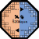

# S2/3Aqua (Sentinel-2/3 Synthetic Aquatic Reflectance Bands) 

The S2/3Aqua is a proto-algorithm that integrates spatial and spectral domains from the Sentinel-2 MSI and Sentinel-3 OLCI images using multivariate regressor models. The S2/3Aqua combines these two sensors to create a new set of synthetic multi-band products that preserve each sensor’s unique characteristics. Here, eight synthetic eight spectral bands (from visible to red-edge domains) at 10-m spatial resolution are generated, making the S2/3Aqua product suitable for addressing the challenges relating to inland waters, such as mapping of potentially harmful algal blooms and enhanced estimative of chlorophyll-a and suspended matter. This proto-algorithm contains three main steps: (1) creation of spatially degraded 10-m Sentinel-2 MSI images using a Point Spread Function; (2) selection of spectral samples across Sentinel-2/3 images using cluster-based sampling approach; and (3) generation of new 10-m eight synthetic spectral bands from multivariate regressor models.

## Requirements and Usage:
S2/3Aqua is coded in Python 3.8 and requires Python packages to run: `numpy`, `pandas`, `geopandas`, `tqdm`, `gdal`, `scipy`, and `sklearn` 

To run the S2/3Aqua, it is necessary a suitable use of the environment `s23aqua` by command line:

            conda env create -f environment.yml
            conda activate s23aqua
            cd into the s23aqua directory
            python api.py

## Input Parameters:
The S2/3Aqua requires four input data: `path_MSI`, `path_OLCI`, `roi`, `dest`.    

* *path_MSI:* directory with Sentinel-2 MSI images;
* *path_OLCI:* directory with Sentinel-3 OLCI images;
* *roi:* path with shapefile from region-of-interest;
* *dest:* output directory.

> The input parameters must be manually filled in `api.py`.

## Output Parameters:
Eight spectral bands at 10-meters (.TIFF) and a file MTD.xml are available in *dest*: `S23AQUA_YYYYMMDD_XXXX_OaXX.tif` and `MTD.xml`.

## Notes:

* The Sentinel-2/3 images should be previously corrected for atmospheric and sun-glint effects;

* S2/3Aqua can present time-consuming for large waterbodies. 

